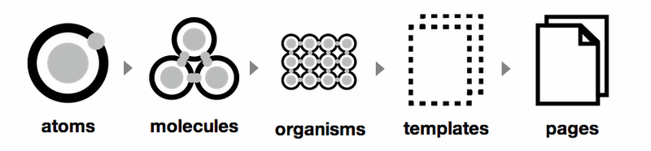

# Numigi DOCS theme

This repository contains a [GROWI](https://github.com/weseek/growi) plugin for the Numigi custom UI theme.

## Getting Started

1. Clone this repository
2. Create a new branch

```bash
git checkout -b MY_BRANCH_NAME
```

3. Install the project dependencies

```bash
npm install
```

4. Test your build

```bash
npm run build
```

5. Commit your changes
6. Open a pull request

### Commits & Releases

#### Committing

Commits format is enforced using [Commitizen](https://github.com/commitizen/cz-cli) and follows the [AngularJS commit standard](https://github.com/angular/angular/blob/main/CONTRIBUTING.md#type).

This allows for [easier automated releases](#automated-releases)

#### Automated Releases

Releases and packages version changes are all automated using [semantic-release](https://semantic-release.gitbook.io/semantic-release).

Its configuration is available in the `.releaserc.json` file.

Make sure that the `TOKEN` action secret is configured and has access to this repository.

## Ressources

This plugin design is based off [GROWI's Vivid Internet plugin example](https://github.com/weseek/growi-plugin-theme-vivid-internet).

### Structure

The structure is divided following a Sass atomic structure. This helps creating and maintaining components rules in many files, from the least complex element to a complete page.



Many articles and blogs refer to this type of architecture convention;

- [Atomic Design System Architecture with SCSS, ITCSS](https://gael-boyenval.gitbook.io/atomic-design-css-architecture-with-itcss-bem-sass/principles/atomic-design-system)
- [Atomic Design - Your Ultimate Guide to Scalable & Modular CSS (Sass)](https://blog.alexdevero.com/atomic-design-scalable-modular-css-sass/)
